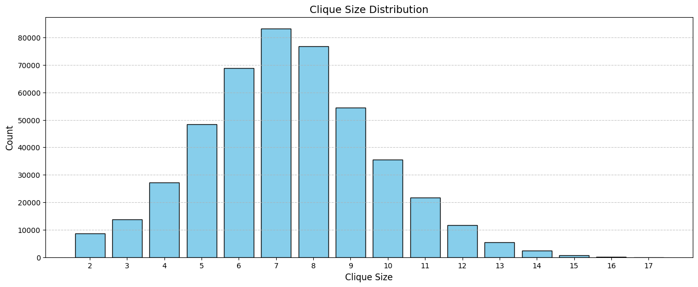

# DAA-Assignment-1
# An implementation of Arboricity algorithm 
&nbsp;&nbsp;&nbsp;&nbsp;We seek to implement the CLIQUE algorithm for Maximal Clique Enumeration Algorithm given in the paper Arboricity and Subgraph Listing by Norishige Chiba AND Takao Nishizeki.  
&nbsp;&nbsp;&nbsp;&nbsp;The algorithm CLIQUE enumerates all maximal cliques in a graph with a time complexity of O(α(G)m) per clique and O(m) space, where α(G) is the graph's arboricity (a sparsity measure which is defined as the number of edge-disjoint forests into which a graph can be decomposed) and m is the number of edges. The algorithm uses Tsukiyama et al's Maximal Independent set algorithm and the strategy of edge searching of subgraph induced by neighbours of vertex under consideration.  
&nbsp;&nbsp;&nbsp;&nbsp;In the algorithm above, "maximality test" checks whether the candidate of a new clique C’ =(C ∩ N(i))∪{i} is indeed a clique (i.e. maximal complete subgraph) of the graph Gi. The "lexico. test" checks whether C is the lexicographically largest clique of Gi-1 containing C ∩ N(i) (= Co), where i is argument of CLIQUE, and Gi is subgraph induced by vertices 1 to i and C is set of vertices to be expanded to form the clique.   
&nbsp;&nbsp;&nbsp;&nbsp;By leveraging vertex ordering (sorted by degree) and efficient pruning via lexicographical checks, the algorithm bounds per-clique operations to a cost proportional to the graph's density and edge count. The proof establishes this using inductive analysis, showing that the time for each recursive step UPDATE(i, C) is dominated by neighborhood intersections and degree sums, while space remains linear due to optimized global variables and disjoint set management. This approach balances theoretical optimality for sparse graphs (α(G) ≈ O(1)) with practical scalability, though it retains exponential worst-case complexity for dense graphs. The method prioritizes low-degree vertices and early elimination of non-maximal cliques, ensuring efficient traversal of the search space.  

## Run Locally

Download the project with the code file

```bash
  git clone https://github.com/DarkTalisman20/DAA-Assignment-1.git
```

Go to the project directory

```bash
  cd DAA-Assignment-1
```

Download the dataset and place it into the project directory/folder.

Compile the file and run it.

For Unix/Mac:

```bash
  g++ chiba.cpp -o chiba.out
  ./chiba.out
```

For Windows:

```bash
  g++ chiba.cpp -o chiba.exe
  ./chiba.exe
```

Input the file name of the graph dataset in the terminal.


## Results
    We executed the C++ implementation of ELS with 3 datasets:

| Dataset        | Nodes   | Edges   |
|---------------|---------|------------|
| as-skitter    | 1,696,415 | 11,095,298 |
| Email-Enron   | 36,692  | 367,662    |
| Wiki-Vote     | 7,115   | 103,689    |


We present the number and count of Maximal Cliques, Size of maximal clique and time taken to execute for these datasets.

For as-skitter:

| Clique Size | Count      |
|------------|-----------|
| 2          | 2,319,807 |
| 3          | 3,171,609 |
| 4          | 1,823,321 |
| 5          | 939,336   |
| 6          | 684,873   |
| 7          | 598,284   |
| 8          | 588,889   |
| 9          | 608,937   |
| 10         | 665,661   |
| 11         | 728,098   |
| 12         | 798,073   |
| 13         | 877,282   |
| 14         | 945,194   |
| 15         | 980,831   |
| 16         | 939,987   |
| 17         | 839,330   |
| 18         | 729,601   |
| 19         | 639,413   |
| 20         | 600,192   |
| 21         | 611,976   |
| 22         | 640,890   |
| 23         | 673,924   |
| 24         | 706,753   |
| 25         | 753,633   |
| 26         | 818,353   |
| 27         | 892,719   |
| 28         | 955,212   |
| 29         | 999,860   |
| 30         | 1,034,106 |
| 31         | 1,055,653 |
| 32         | 1,017,560 |
| 33         | 946,717   |
| 34         | 878,552   |
| 35         | 809,485   |
| 36         | 744,634   |
| 37         | 663,650   |
| 38         | 583,922   |
| 39         | 520,239   |
| 40         | 474,301   |
| 41         | 420,796   |
| 42         | 367,879   |
| 43         | 321,829   |
| 44         | 275,995   |
| 45         | 222,461   |
| 46         | 158,352   |
| 47         | 99,522    |
| 48         | 62,437    |
| 49         | 39,822    |
| 50         | 30,011    |
| 51         | 25,637    |
| 52         | 17,707    |
| 53         | 9,514     |
| 54         | 3,737     |
| 55         | 2,042     |
| 56         | 1,080     |
| 57         | 546       |
| 58         | 449       |
| 59         | 447       |
| 60         | 405       |
| 61         | 283       |
| 62         | 242       |
| 63         | 146       |
| 64         | 84        |
| 65         | 49        |
| 66         | 22        |
| 67         | 4         |


Time taken: 
Total number of cliques: 37,322,355
The size of the largest maximal clique: 67


For Email-Enron:

| Clique Size | Count  |
|------------|--------|
| 2          | 14,070 |
| 3          | 7,077  |
| 4          | 13,319 |
| 5          | 18,143 |
| 6          | 22,715 |
| 7          | 25,896 |
| 8          | 24,766 |
| 9          | 22,884 |
| 10         | 21,393 |
| 11         | 17,833 |
| 12         | 15,181 |
| 13         | 11,487 |
| 14         | 7,417  |
| 15         | 3,157  |
| 16         | 1,178  |
| 17         | 286    |
| 18         | 41     |
| 19         | 10     |
| 20         | 6      |

Time taken: 
Number of cliques: 226859
Size of the largest maximal clique: 20


For Wiki-Vote:

| Clique Size | Count   |
|------------|--------|
| 2          | 8,655  |
| 3          | 13,718 |
| 4          | 27,292 |
| 5          | 48,416 |
| 6          | 68,872 |
| 7          | 83,266 |
| 8          | 76,732 |
| 9          | 54,456 |
| 10         | 35,470 |
| 11         | 21,736 |
| 12         | 11,640 |
| 13         | 5,449  |
| 14         | 2,329  |
| 15         | 740    |
| 16         | 208    |
| 17         | 23     |

Time taken: 
Total number of cliques: 459,002
Size of the largest maximal clique size: 17


