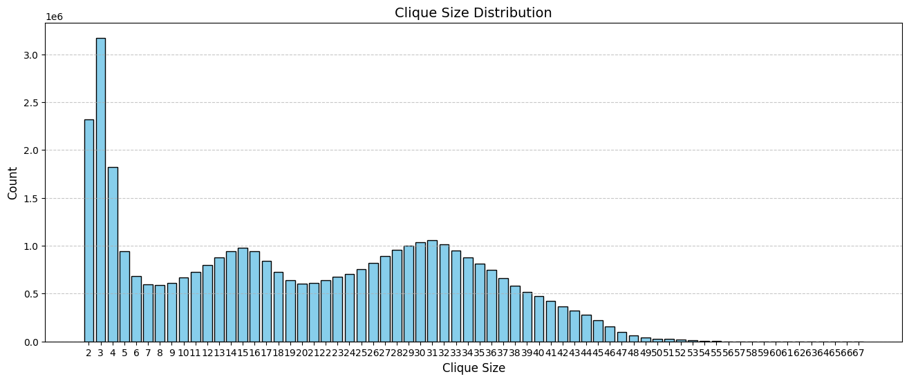
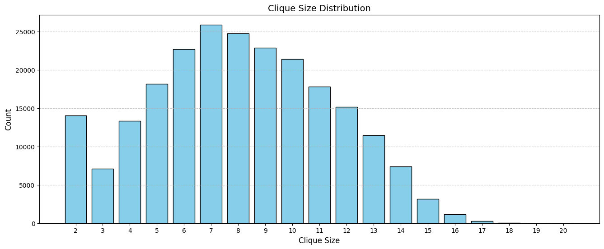
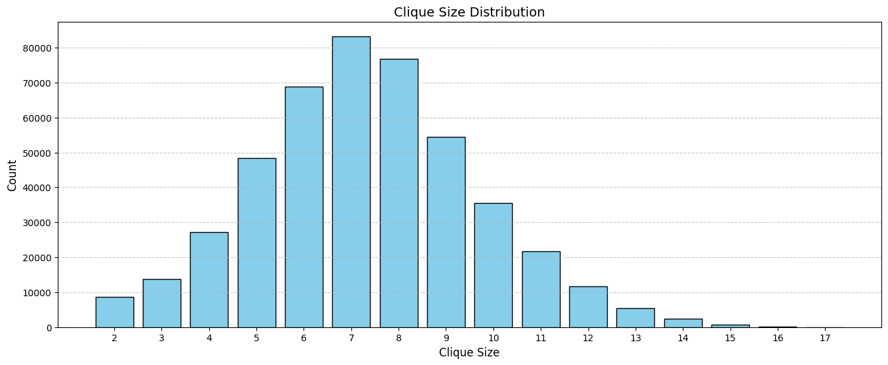

```md
# An Implementation of Tomita Algorithm
&nbsp;&nbsp;&nbsp;&nbsp;We seek to implement the maximal clique enumeration algorithm based on Tomita et al.'s approach. The implementation uses C++ to closely mimic the pseudo-code described by Tomita and collaborators, leveraging STL containers and algorithms for efficiency.  
&nbsp;&nbsp;&nbsp;&nbsp;This algorithm is a refined variant of the Bron-Kerbosch recursive method, enhanced with a pivot selection strategy. In this method, three disjoint sets of vertices are maintained:
- **P**: the set of candidate vertices for inclusion in the clique,
- **R**: the clique constructed so far, and
- **X**: the set of vertices that have already been processed (excluded from the current clique).

&nbsp;&nbsp;&nbsp;&nbsp;The recursion terminates when both **P** and **X** are empty, at which point **R** represents a maximal clique. Otherwise, the algorithm selects a pivot vertex **u** from **P ∪ X** such that **u** has the largest number of neighbors in **P**. It then iterates over each vertex **v** in **P** that is not adjacent to **u**, and recursively calls the algorithm with updated sets:
- **P** is replaced by **P ∩ neighbours(v)**,
- **R** is updated to **R ∪ {v}**, and
- **X** becomes **X ∩ neighbours(v)**.

&nbsp;&nbsp;&nbsp;&nbsp;After the recursive call returns, **v** is removed from **P** and added to **X**. An early pruning strategy is also used: if the size of **R** plus the number of vertices in **P** is less than or equal to the size of the largest clique found so far, the recursion stops early, saving computational time.

## Run Locally

Download the project with the code file

```bash
git clone https://github.com/DarkTalisman20/DAA-Assignment-1.git
```

Go to the project directory

```bash
cd DAA-Assignment-1
```

Download the dataset and place it into the project directory/folder.

Compile the file and run it.

For Unix/Mac:

```bash
  g++ 21march.cpp -o Tomita.out
  ./Tomita.out
```

For Windows:

```bash
  g++ 21march.cpp -o Tomita.exe
  ./Tomita.exe
```

Input the file name of the graph dataset in the terminal.

## Results

*The following results are based on executing the C++ implementation of the Tomita-based maximal clique algorithm on various datasets. The output includes the number of maximal cliques found, the size of the largest clique, and the execution time.*

| Dataset       | Nodes     | Edges      |
|---------------|-----------|------------|
| as-skitter    | 1,696,415 | 11,095,298 |
| Email-Enron   | 36,692    | 367,662    |
| Wiki-Vote     | 7,115     | 103,689    |

*Example results for as-skitter:*

- **Time taken**: Approximately 8 hours
- **Total number of maximal cliques**: 37,322,355  
- **Size of the largest maximal clique**: 67  



*Example results for Email-Enron:*

- **Time taken**: 23 seconds  
- **Total number of maximal cliques**: 226,859  
- **Size of the largest maximal clique**: 20  



*Example results for Wiki-Vote:*

- **Time taken**: 4 seconds
- **Total number of maximal cliques**: 459,002  
- **Size of the largest maximal clique**: 17  


```
